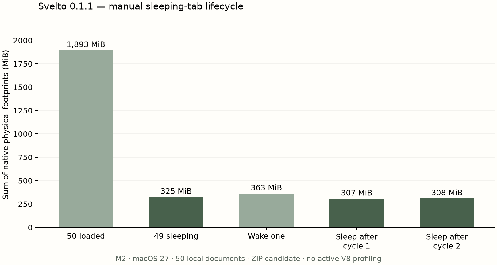

# Sleeping tabs and resource investigation on macOS

Measured 2026-10-10, Apple M2 / 8 GiB / macOS 27.0 (26A428), ARM64, Electron 43.4.1. Product version: Svelto 0.1.1. The production change is **manual sleeping tabs**; there is no automatic eviction or timer-based reload.

## User-visible behavior

Right-click an inactive tab and choose **Sleep tab — reloads when reopened**. The tab keeps its place, ID, title and address, receives a dotted underline and an accessible Sleeping label, and releases its page contents. Click it or choose Wake tab to reload it. Back/Forward history is restored in the live session; scroll and mute settings survive waking. Sleeping intent persists through restart, but the in-memory navigation stack does not persist through application restart.

The main process rejects active tabs in any window, including views temporarily hidden by Tasks; private tabs, non-HTTP(S) documents, loading pages, audible/playing media, downloads and pending permissions or capture grants. A separate isolated-world DOM probe rejects changed form values, file selections, active HTML media, editable content, frames and canvas/plugin content. Navigation identity and eligibility are rechecked after the asynchronous probe. Native `beforeunload` vetoes are respected. A selection during the probe cancels sleep; a selection during native close waits for completion and recreates the page if needed. Closing the tab also removes its saved navigation stack.

These checks are conservative and can reject otherwise idle pages. Custom JavaScript state that neither uses editable controls nor signals `beforeunload` cannot be detected in general: waking reloads the document, as stated in the menu. Private tabs and embedded editors are intentionally not supported. Capture permission grants keep a page awake until its permission state is reset by navigation/reload. No automatic suspend setting is introduced.

## Profiling the capture hypothesis

The existing GUI requests a downsampled preview every 15 seconds. The main process first captures the full page, then resizes and encodes it. A temporary diagnostic copy records the whole capture pipeline and V8 main-process CPU profiles; the shipped preview does **not** contain these hooks. Website debuggers are detached before fixture loading, and only the trusted GUI Runtime connection remains. Fifty static local documents use the same 200-card fixture as the earlier measurements. All phases run within the same process and alternate the sole intervention: forwarding or dropping `getCapture` requests.

Each phase contains 90 native process CPU intervals, approximately 96 real seconds including sampling overhead. 100% means one logical CPU. V8 profiles use a 1 ms sample interval, which adds main-process overhead; these CPU means must not be compared directly with earlier unprofiled measurements. The host is shared and interval quantization, garbage collection and phase order are uncontrolled.

| Phase | Capture policy | Mean CPU % | Completed captures | End footprint MiB |
| --- | --- | ---: | ---: | ---: |
| 1 | Normal | 5.01 | 6 | 1808.7 |
| 2 | Suppressed | 3.82 | 0 | 1782.4 |
| 3 | Normal | 4.07 | 6 | 1791.8 |
| 4 | Suppressed | 4.07 | 0 | 1772.5 |

Normal mean across the two phases: 4.54%; suppressed: 3.94%. The third normal phase is close to the fourth suppressed phase, so this sequence does not establish a repeatable whole-app CPU improvement from removing the timer.

The six first-phase captures take approximately 20–34 ms each, including roughly 4 ms resize and 1–2 ms encoding; CPU measured over each asynchronous capture overlaps other main-process work and cannot be treated as exclusive capture CPU. Main V8 profiles are overwhelmingly idle. First-phase self samples include about 27 ms in `resize`, 9 ms in `toDataURL` and 6 ms in `capturePage`; the profiler itself also appears in the samples. These functions are a confirmed cost, but are insufficient evidence that this timer explains the earlier intermittent peaks.

A separate **amplified stress control**, four captures per second for 15 seconds, raises whole-app mean CPU to 10.84%. Its main-process profile records about 347 ms self time in `resize`, 52 ms in `toDataURL` and 30 ms in `capturePage`. This identifies the capture/resizing pipeline under amplification, not a normal browsing workload. The production timer is therefore retained; no claim that the intermittent CPU issue is fixed is made. A future Chromium native trace should target the remaining peaks with the profiler overhead controlled.

## Memory: ownership and actual page release

The previous two-hour mixed-site run initially fell to 1105.8 MiB at 25 minutes, then reached 1198.0 MiB at 120 minutes. From those two checkpoints, helper footprint grew by about 66 MiB and renderer footprint by 35 MiB; main-process footprint fell by about 5 MiB. The earlier raw process names do not reliably split GPU from network helpers. This pattern does not establish a JavaScript heap leak or prove leak freedom.

The new diagnostic uses Electron process metrics and native process arguments to identify Browser, GPU, Utility and renderer PIDs. The primary profiling candidate has nearly stable GPU footprint around 399 MiB across its first three phases; it falls to 371 MiB in the final suppressed phase. Amplified capture then increases GPU footprint to 427 MiB. Sleeping 49 pages subsequently drops it to 45 MiB, while page renderer processes exit. This is compatible with retained capture/render resources being released; it is not a proof that every allocator cache or page workload is leak-free. HTTP cache size is zero for the no-store local fixture, so these observations are not explained by that disk cache.

The table below comes from a **fresh copy of the ZIP-extracted 0.1.1 candidate (the final archive additionally removes extra title dimming and guards late updates for nonvisible Tasks)**, without active V8 profiling or amplified captures. After loading/settling 50 tabs, 49 are manually suspended. Two additional rounds each wake ten tabs, return to the surviving tab, sleep those ten again and wait ten seconds. Only one page view remains at each final checkpoint. The original tab order and URLs remain intact.

| State | Native total MiB | Page views | Browser MiB | GPU MiB | All renderers MiB | Main JS heap used MiB |
| --- | ---: | ---: | ---: | ---: | ---: | ---: |
| 50 loaded tabs | 1892.6 | 50 | 205.4 | 462.7 | 1230.7 | 23.97 |
| 49 sleeping tabs | 324.9 | 1 | 143.9 | 48.2 | 123.4 | 23.71 |
| Wake one | 362.5 | 2 | 135.3 | 76.1 | 143.4 | 23.93 |
| Sleep after cycle 1 | 306.6 | 1 | 130.9 | 44.9 | 122.7 | 24.49 |
| Sleep after cycle 2 | 308.3 | 1 | 129.3 | 44.5 | 126.5 | 24.89 |

The first suspension reduces measured footprint from **1892.6 to 324.9 MiB (82.8%)**. This is a bounded fixture result, not a guarantee for arbitrary websites. Native totals are sums of per-process physical footprints, not RSS or a deduplicated machine-wide allocation. Per-role sums can differ from the native aggregate. Two repeated lifecycle checkpoints cannot establish long-session leak freedom; they verify that page ownership and process counts return to the expected state.



## Verification and artifact

The ZIP-extracted app passes 18 suspension checks: active/private tabs, drafts/editors, native unload veto, Web Audio, pending capture consent with fake devices, actual interrupted download, menu wiring and page destruction, sleeping-tab unmute without waking, navigation history/scroll/mute restoration, Tasks hiding, cross-window protection and sleeping/waking across different Tasks, loading, selection race, restart and meaningful error-free GUI. The test sends a real DOM contextmenu event and routes its captured menu callback; the native popup selection itself is not manually verified. The actual tab click wakes the page. Native Escape dismisses address editing before screenshots. Light/dark use the real theme switch; viewports are 1100×760 and 720×620. Browser plugin unavailable; Playwright Electron fallback used.

The final ZIP-extracted preview passes **119 checks**: 18 suspension checks plus the existing 101 production checks (28 general, 17 collections, 16 reading, 14 permission-policy, 11 permissions/files, seven snapshot-store and eight packaged session checks). The corrected suspension harness directs actions to its owning GUI when two windows are present; its complete rerun passes. Existing lint debt remains, but changed browser modules add no Standard diagnostic categories/counts relative to the parent and the new main suspension module has zero diagnostics. One suspension launch encountered the previously observed `Resulting promise was garbage collected` inspector failure; a fresh-profile complete run passed. This does not resolve the existing debugger/runtime investigation. The initial full regression run also exposed a reproducible background-Task toolbar update exception that stopped later state synchronization. The fix ignores tabs without a visible element in the current Task, and ordinary view creation no longer emits redundant sleeping-state updates. A new cross-window sleep/wake check and the session regression verify this case.

Preview archive: `output/svelto-v0.1.1-mac-arm64.zip`. Both packaged and ZIP-extracted bundles pass strict deep ad hoc signature verification. The final archive adds modification-notice comments only: main/CSS/preload bundles are byte-identical to the 119-check candidate, and the GUI bundle is identical after excluding four added comment lines. Its complete 18-check suspension suite is run again on the final extraction. Not notarized; Developer ID/Gatekeeper distribution validation remains open. Windows/Intel and real OS capture/chooser/print/VoiceOver coverage are unchanged.

Main JavaScript SHA-256: `3971e17ec67d7450cc655f2bca2f33d13e8dbfd86a51e22638b32177a56025d4`. ZIP SHA-256: `cbe51d5e4b440ba425a5d2ea9a8bc957544427be2ebcba3666649ae8fd1a5931`. Primary CPU candidate diagnostic main SHA-256: `11964735402ae4f633a793457b48f3735609dcf687b53395adfe338f983cff10`; final lifecycle diagnostic main SHA-256: `55e1ef3c60b429a8d959e0abb9eb8cda9b8b437ec7ee7303b0fdf0e27143cef8`. Diagnostic hashes include temporary hooks, so differ from the shipped bundle. Source parent is `666cf69` plus this pass's working changes; the CPU candidate precedes final capture-lifetime/mute/visual and background-Task refinements. Raw logs, native footprint samples and CPU profiles are retained locally under ignored `output/`; failed startup calibrations are excluded from headline measurements.

```sh
npm run buildMacArm
npm run test:suspension
npm run benchmark:resources
SVELTO_RESOURCE_LIFECYCLE_ONLY=1 SVELTO_RESOURCE_COUNTS=50 SVELTO_USAGE_OUTPUT=output/resource-cycles-macos.json npm run benchmark:resources
```

The benchmark creates, signs and deletes its own temporary app copy and uses a disposable user-data profile; it does not alter the shipping app. No Node inspector port is exposed. Navigation restoration and beforeunload behavior follow the [Electron navigation-history API](https://www.electronjs.org/docs/latest/api/navigation-history) and [webContents.close API](https://www.electronjs.org/docs/latest/api/web-contents#contentscloseopts).
