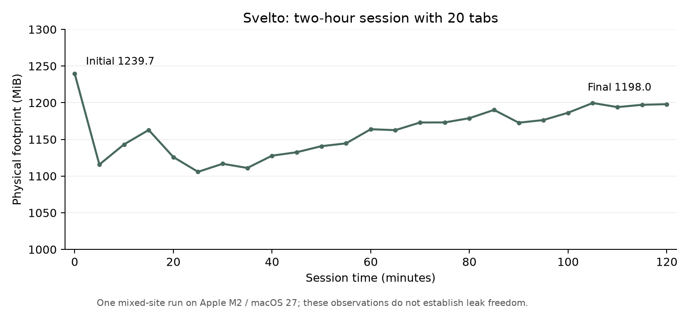

# macOS usage and performance verification

Measured 2026-10-10 on the existing Svelto preview, app source **76298e6**. This pass adds repeatable measurement tools and evidence; it does not change the browser runtime or claim a performance improvement.

## Environment and method

Apple M2 (Mac14,2), 8 GiB RAM, eight logical CPUs, macOS 27.0 (26A428), ARM64; Electron 43.4.1. Observer: Node 24.10, Playwright 1.62.1, native `ps`, `footprint`, `sample` and an AppKit activation helper compiled with `swiftc`. Main bundle JavaScript SHA-256: `560193b221757160e989eda96f03c8807ac9ed03a107214968231bf08549bf85`.

Every test uses a disposable seeded profile, separate from personal Svelto data. The Browser plugin was unavailable, so Playwright/CDP supplies automation. Resource windows detach website debuggers; CPU runs also disconnect the GUI client. This avoids the earlier observation effect that made inspected background documents visible. The latency test deliberately uses CDP for GUI input and DOM observation. Native `sendInputEvent` triggers Cmd+L/Escape with the test window verified foreground. No Node inspector is enabled.

Only the launched app and its recursively identified children count toward CPU/memory. **100% CPU means one logical CPU**, not the whole M2. CPU uses per-process elapsed CPU-time deltas, with approximately one-second intervals and native timer quantization. Footprint is the macOS physical-footprint total across the exact sampled PIDs, verified for coverage, byte units and no tool errors. RSS is retained in raw data but must not be read as physical memory.

The machine is shared with other applications. Some tests ran concurrently with the long session; host contention, compression, filesystem caches and network are uncontrolled. These are bounded observations on one host, not reproducible speed claims or comparisons against Min, Safari or Chrome.

## CPU bursts: two independent 50-tab runs

Each profile loads 50 static local documents (200 cards each); 49 background documents are verified hidden. Each run collects 180 CPU intervals. A native two-second stack sample is collected after the first individual process crosses 15%; that collection is marked in raw data and excluded from the next CPU delta.

| Run | Mean CPU % | Median interval % | p95 interval % | Maximum interval % | Initial footprint MiB | Final footprint MiB |
| --- | ---: | ---: | ---: | ---: | ---: | ---: |
| 1 | 2.99 | 0.95 | 10.62 | 39.47 | 2063.7 | 1815.2 |
| 2 | 3.28 | 0.94 | 13.22 | 46.17 | 2133.4 | 1851.2 |

The longer-window means are roughly 3%, while intermittent aggregate bursts remain. The first sampled individual peak was the main process at interval 130 in run 1 and interval 102 in run 2. Samples taken after a peak mostly show AppKit/Mach event waiting and stripped Electron native symbols: they do **not** identify a definite JavaScript, GC or GPU cause. Do not label this issue fixed or confined to startup.

| Process group | Run 1 mean CPU % | Run 2 mean CPU % |
| --- | ---: | ---: |
| Main | 0.94 | 0.97 |
| GPU/network helper group | 0.25 | 0.26 |
| Trusted GUI/history renderer group | 0.20 | 0.21 |
| Website renderers | 1.60 | 1.84 |

Helper values are grouped from process identities; this table does not isolate every utility role. Earlier short 50-tab control windows averaged about 15–17%; different launch/settling/observer conditions and shared-host effects prevent interpreting the new values as an optimization.

## Real sites, scrolling and video

The test verifies meaningful content, titles/URLs, actual scrolling, and 120 requestAnimationFrame opportunities while scrolling eight pixels per callback. Pages accumulate, so the CPU number is the **whole app during a 15-second window**, not the individual site's exclusive cost. Load means add-tab to the harness's meaningful-content check, not navigation timing or first paint.

| Page | Meaningful load ms | Median RAF gap ms | Maximum RAF gap ms | Whole-app mean CPU % |
| --- | ---: | ---: | ---: | ---: |
| [Web browser - Wikipedia](https://en.wikipedia.org/wiki/Web_browser) | 4696 | 6.9 | 21.9 | 1.63 |
| [&lt;video&gt; HTML video embed element - HTML / MDN](https://developer.mozilla.org/en-US/docs/Web/HTML/Reference/Elements/video) | 11966 | 6.9 | 13.4 | 3.40 |
| [GitHub - minbrowser/min: A fast, minimal browser that protects your privacy · GitHub](https://github.com/minbrowser/min) | 19376 | 6.9 | 9.2 | 2.46 |
| [Performance / Electron](https://www.electronjs.org/docs/latest/tutorial/performance) | 11191 | 6.9 | 8.8 | 5.25 |

All four pages pass. Captured browser-GUI errors are empty. Website startup consoles are not comprehensively captured while their debuggers are detached, so this does not mean every remote page has zero console errors. RAF callbacks occur before repaint and are not a hardware frame-rate or pixel-presentation measurement.

The initial streaming check plays the public MDN flower clip in a local document with native controls. At the ten-second observation it reports 64 decoded frames, zero reported drops, currentTime 2.004 s and no media error. Looping, buffering and foreground contention make this insufficient evidence of uninterrupted playback. A metadata-only preload calibration timed out and is excluded. The subsequent control starts playback to fill the buffer, then resets playback time for measurement. A separate fully buffered test follows below; the initial observation is retained rather than treated as a fluidity guarantee.

Buffered-video test status: **complete**.

After buffering the short 5.055 s clip to within 0.1 s of its duration, the visible document plays for 10.016 s. Reported decoded frames: 299; dropped frames during the measured interval: 0; waiting events: 2 (at playback time zero); stalled events: 0. Whole-app CPU during the following 20 seconds: 12.62%. Initial seeking and loop resets may emit waiting events even with complete buffering. This separate one-video-tab workload cannot be compared directly with the accumulated five-tab streaming run.

## Address bar, suggestions, history and tab switching

Thirty local documents are loaded and their history indexing is explicitly confirmed before the trials. Thirty trials exercise native Cmd+L, focused editor input, controlled remote suggestions, ArrowDown selection, native Escape, local history results, and a click on a different tab with selected-state verification. The controlled suggestions return immediately; the measured DOM interval includes the existing approximately 50 ms debounce.

p95 uses nearest rank (`ceil(0.95 × N)`). All times are milliseconds.

| Measurement | Median | p95 | Maximum |
| --- | ---: | ---: | ---: |
| Cmd+L dispatch to visible editor | 15.45 | 32.09 | 83.66 |
| Synthetic typing dispatch | 13.57 | 19.41 | 20.46 |
| Typing start to observed controlled results | 74.05 | 78.88 | 82.52 |
| Last input to controlled suggestion DOM | 52.55 | 58.60 | 67.70 |
| Fill to observed history result | 6.22 | 10.96 | 20.95 |
| Click to verified selected tab | 25.53 | 36.43 | 82.68 |
| Input event to next RAF opportunity (500 events) | 2.90 | 6.40 | 9.10 |

DOM/RAF timings are in-renderer observations, not physical keyboard-to-pixel latency. External dispatch/focus/history/switch values include automation and IPC overhead. No cold-start indexing claim is made. All 30 trials pass, with no captured GUI errors and no pending or late harness replies.

Actual DuckDuckGo autocomplete is then measured separately with three non-personal queries; all three return HTTP 200 and render suggestions. These are individual network observations, not a stable service benchmark.

| Query | Request to JSON ms | Input dispatch to observed results ms |
| --- | ---: | ---: |
| lightweight browser | 1494.7 | 1602.3 |
| web standards | 164.5 | 253.1 |
| macOS browser | 516.5 | 605.4 |

## Long session and abrupt-termination recovery

Twenty tabs comprise the same four public sites and sixteen local documents. Every five minutes the harness activates a rotating tab, checks meaningful content and scrolls it, samples footprint, and confirms that a surviving local document retains its in-memory token and unsaved input. There is no automatic suspension or reload of that document. The intended interval is **7,200 real seconds after setup**, followed by SIGKILL of only the test main process and relaunch with the same disposable profile.

Completed **7200.9 seconds**, 24 checkpoints and successful recovery. Initial footprint 1239.7 MiB; final 1198.0 MiB; observed range 1105.8–1239.7 MiB. Tab count, ordered IDs/URLs and selected tab match after relaunch; the selected real page reloads with meaningful content. All live-session draft/token checks and captured GUI-error checks pass.

The footprint drops after setup, then trends upward across tab activations with intervening decreases. The final value is below the initial value; this does not distinguish caching/working-set changes from small leaks. A matched repeated run and per-process trends are needed for attribution.



| Checkpoint minute | Footprint MiB | Live draft/token | Captured GUI errors |
| --- | ---: | --- | ---: |
| Initial | 1239.7 | Set | 0 |
| 5 | 1115.7 | Preserved | 0 |
| 10 | 1143.2 | Preserved | 0 |
| 15 | 1162.8 | Preserved | 0 |
| 20 | 1125.9 | Preserved | 0 |
| 25 | 1105.8 | Preserved | 0 |
| 30 | 1116.8 | Preserved | 0 |
| 35 | 1111.1 | Preserved | 0 |
| 40 | 1127.8 | Preserved | 0 |
| 45 | 1132.5 | Preserved | 0 |
| 50 | 1140.8 | Preserved | 0 |
| 55 | 1144.6 | Preserved | 0 |
| 60 | 1163.9 | Preserved | 0 |
| 65 | 1162.6 | Preserved | 0 |
| 70 | 1173.1 | Preserved | 0 |
| 75 | 1173.1 | Preserved | 0 |
| 80 | 1178.9 | Preserved | 0 |
| 85 | 1190.2 | Preserved | 0 |
| 90 | 1172.7 | Preserved | 0 |
| 95 | 1176.4 | Preserved | 0 |
| 100 | 1186.3 | Preserved | 0 |
| 105 | 1199.6 | Preserved | 0 |
| 110 | 1194.0 | Preserved | 0 |
| 115 | 1197.2 | Preserved | 0 |
| 120 | 1198.0 | Preserved | 0 |

These samples can reveal sustained growth in this workload; they do not prove absence of leaks on every site or over days. Unsaved form content is checked during the live session only. Browser session recovery restores tab metadata, not unsaved forms after process termination. Power loss, full disk, update interruption, renderer/GPU crashes and recovery of all remote page states remain separate tests.

## Harness validation and excluded calibrations

Early calibration used CDP keyboard commands that did not trigger the native accelerator, and began history assertions before indexing completed. Later tests use Electron native input and wait for indexed fixtures. A first long run was stopped after late replies from read-only harness probes reached the browser's existing callback handler. This was an instrumentation collision, not an established production bug.

The final runner permanently routes only its own string `usage-` call IDs and forwards all normal app replies to the original listeners. A deliberate 16-second reply against the harness's 15-second timeout verifies containment, an empty GUI error list and a subsequent successful normal probe. The final real-site run records one safely discarded late harness reply and zero pending callbacks. The final 30-trial latency run has zero late/pending replies. Discarded short/interrupted calibration runs do not count toward two-hour completion.

Extracting reusable helpers preserves the original benchmark CLI. A one-repeat five-tab native-control smoke test passes with four hidden documents and exact footprint PID coverage. Both JavaScript runners pass syntax checks; AppKit activation is compiled and exercised by the foreground tests. Existing 101 production regressions were established for app 76298e6 in prior verification, not rerun in this benchmark-only pass.

## Reproduction and evidence

Run from a hydrated checkout with dependencies installed and a packaged macOS ARM64 Svelto app. Set `SVELTO_TEST_EXECUTABLE` to `Svelto.app/Contents/MacOS/Svelto` if it is not at the default build path. Record the actual app source commit with `SVELTO_BENCH_SOURCE_COMMIT` when testing a prebuilt app; this variable is provenance supplied by the operator, not automatic bundle verification. Xcode command-line tools are needed for the AppKit helper.

```sh
npm run benchmark:cpu
npm run benchmark:sites
npm run benchmark:latency
caffeinate -i npm run benchmark:soak
SVELTO_USAGE_MODE=latency SVELTO_USAGE_LATENCY_TRIALS=0 SVELTO_USAGE_LIVE_SEARCH=1 SVELTO_USAGE_OUTPUT=output/usage-search-live-macos.json node scripts/benchmarks/usage-macos.cjs
SVELTO_USAGE_MODE=sites SVELTO_USAGE_VIDEO_ONLY=1 SVELTO_USAGE_OUTPUT=output/usage-video-buffered-macos.json node scripts/benchmarks/usage-macos.cjs
```

Defaults: CPU two × 180 intervals at 50 tabs; latency 30 trials at 30 tabs; soak 7,200 seconds at 20 tabs. `SVELTO_USAGE_OUTPUT` separates supplemental observations. Shorter soak overrides are calibration only. Runtime profiles are disposable and deleted by the runner after completion. macOS tooling may need local process-inspection access.

Ignored local `output/` retains the complete CPU/site/latency/live-search/soak JSON, optional buffered-video JSON and two native CPU stack files. The committed report preserves the headline measurements and complete five-minute memory series. JSON provenance includes bundle hash and, in later runs, runner/helper hashes; the CPU run predates automatic runner hashing. The two-hour process executes the runner loaded at launch even if later video-only instrumentation edits change the source file.

Method references: [Electron native input and focus requirements](https://www.electronjs.org/docs/latest/api/web-contents/#contentssendinputeventinputevent), [requestAnimationFrame semantics](https://developer.mozilla.org/en-US/docs/Web/API/Window/requestAnimationFrame), [MDN sample video page](https://developer.mozilla.org/en-US/docs/Web/HTML/Reference/Elements/video).

## Observation provenance

| Result file | Status | Runner SHA-256 |
| --- | --- | --- |
| `usage-cpu-macos.json` | complete | `not recorded in early CPU run` |
| `usage-sites-macos.json` | complete | `df9ffb77eeebb052430afc408bec8ecf14868ea268f6e3593ec88234eefdcbaa` |
| `usage-latency-macos.json` | complete | `df9ffb77eeebb052430afc408bec8ecf14868ea268f6e3593ec88234eefdcbaa` |
| `usage-search-live-macos.json` | complete | `df9ffb77eeebb052430afc408bec8ecf14868ea268f6e3593ec88234eefdcbaa` |
| `usage-video-buffered-macos.json` | complete | `3f26bde8d29560c3c1082ef8caea5aea7b53b8963bdc23c09712b0d7b76a2ac1` |
| `usage-soak-macos.json` | complete | `df9ffb77eeebb052430afc408bec8ecf14868ea268f6e3593ec88234eefdcbaa` |

## Remaining scope

These bounded investigations do not establish release readiness. Intermittent CPU bursts still need causal profiling; broader media, login-heavy sites, power/battery, repeated longer sessions and additional Mac hardware remain open. VoiceOver, real native print/file/media-permission flows, distribution signing/notarization, Intel and Windows remain tracked in the roadmap. The preview ZIP is unchanged, ad hoc signed and not notarized.

## Follow-up: manual sleeping tabs

Preview 0.1.1 implements manual suspension and adds targeted capture profiling and per-process resource lifecycle measurements. See [sleeping tabs and resource investigation](MACOS_SUSPENSION_RESOURCE_REPORT.md). The historical observations above retain their original workload and source provenance.
